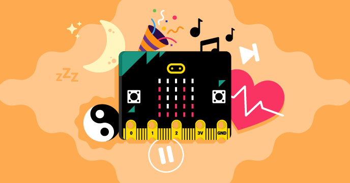

## Introduction

The BBC micro:bit is a pocket-sized computer that has sensors and outputs built in. You can use it to create physical computing projects that interact with the real world.

[The micro:bit Foundation](https://microbit.org/){:target="_blank"} is an educational charity that created the micro:bit and the [MakeCode editor](https://makecode.microbit.org/#){:target="_blank"} to get young people excited about coding.

 The brand new <a href="https://projects.raspberrypi.org/en/pathways/microbit-intro">Introduction to micro:bit path</a> will help you take your first steps with the BBC micro:bit. Along the way, you will create projects that are fun, and help you manage your wellbeing!

### What you will make

You will take a tour of both the micro:bit device and MakeCode editor. You will connect your micro:bit to your computer, pair it with MakeCode, and download your program onto the physical device. 

The rest of this project will guide you through making projects with the components on the micro:bit!

--- collapse ---
---
title: What you will need
---
### Hardware

+ A computer
+ A BBC micro:bit (V1 or V2)
+ A micro USB cable
+ Battery pack and two AAA batteries
+ Wired headphones and crocodile cables (**V1 micro:bit only**)

### Software

+ A browser to run the MakeCode editor

--- /collapse ---

--- collapse ---
---
title: What you will learn
---

+ How to use the MakeCode editor
+ How to connect your micro:bit to your computer and download a MakeCode program to it
+ How to use the micro:bit's components, like the LEDs, sensors, buttons and speaker (V2 only)

--- /collapse ---

--- collapse ---
---
title: Additional information for educators
---

If you are completing this project in a school or other setting with a managed network, then you should make sure that you have the appropriate permissions to mount a USB drive and install software.

If you need to print this project, please use the [printer-friendly version](https://projects.raspberrypi.org/en/projects/getting-started-guide-microbit/print){:target="_blank"}.

Completed versions of the mini-projects can be found on each of the steps.

--- /collapse ---
