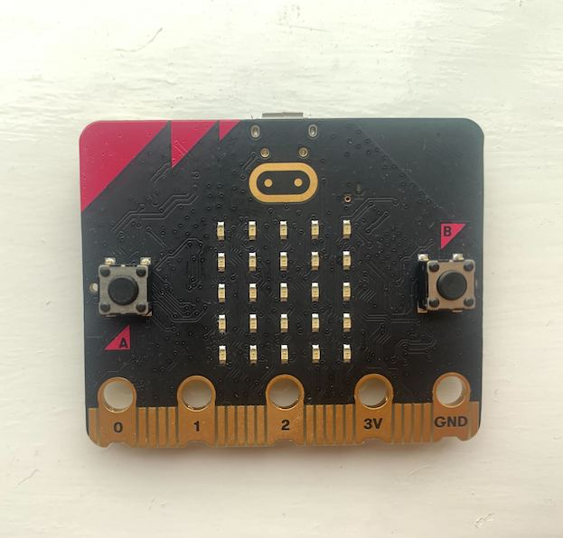
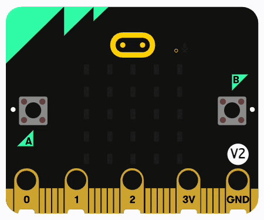
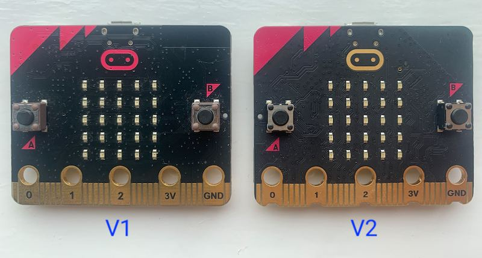

## Meet the micro:bit

This is the BBC micro:bit. 

--- collapse ---

---
title: History of the device
---

The original BBC micro:bit device (the V1) was released in 2016. It was inspired by the BBC Micro computer that was used to encourage students in the 1980s to get into programming. One of the young programmers the BBC Micro inspired was Raspberry Pi founder Eben Upton. The micro:bit Foundation is on a mission to use the micro:bit to inspire the next generation of programmers. 

In 2020, they released the BBC micro:bit V2. It comes with some new components, such as a speaker and a new touch input button.

--- /collapse ---

### What's on the device?

Both the micro:bit V1 and V2 have the following components for you to use: 

#### LED matrix

There are **25** LEDs on the front face that you can use to show pictures, numbers, and words. 

#### Buttons

There are two front input buttons, A and B, that you can use to interact with the programs that you write. 

#### Sensors

There are a number of sensors on the device that you can use to take readings, including: 

1. A magnetometer
2. A temperature sensor
3. A light sensor

**Accelerometer**

There is an accelerometer that you can use to detect the rotation and motion of the micro:bit. 

#### Four GPIO pins

Just like a Raspberry Pi, Raspberry Pi Zero and the Raspberry Pi Pico the micro:bit has **general purpose input output** pins. There are four pins and a single ground pin. You can use these to connect a range of extra components for physical computing projects. 

#### Radio

Every micro:bit has the ability to communicate with other micro:bits over radio — allowing you to send messages or data between the devices.

### What's new on the V2?

The newer version of the micro:bit has some extra components that aren't available on the micro:bit V1.

All our projects will be backwards compatible (with a few changes) and work on either version of the micro:bit. 

#### Speaker

There is an onboard speaker to play melodies, notes, and short audio clips. 

#### Microphone/sound sensor

The micro:bit V2 has an MEMS microphone that is capable of detecting sound levels and even recording short audio clips.

#### Touch-sensitive logo

There is a new input button — the micro:bit logo on the front face is now touch sensitive. You can program different things to happen when it is pressed, held for a long time, or released (when someone stops touching it). 

### How can you tell which device version you have?

The best way to tell which micro:bit version you have is to check the micro:bit logo on the front face. 

If the logo is the same colour as the triangles in the corner of the device, then it is a V1. 

If the logo is a metallic gold colour (the same as the GPIO pins on the bottom), then you have a V2.

--- task ---

Take a look at your micro:bit and identify which version you have. 

--- /task ---

--- task ---

Turn the micro:bit over so you are looking at the back, and see if you can find all the components mentioned above.

--- /task ---

--- task ---

Plug the micro USB end of your cable into the port on the top of the micro:bit.

--- /task ---

