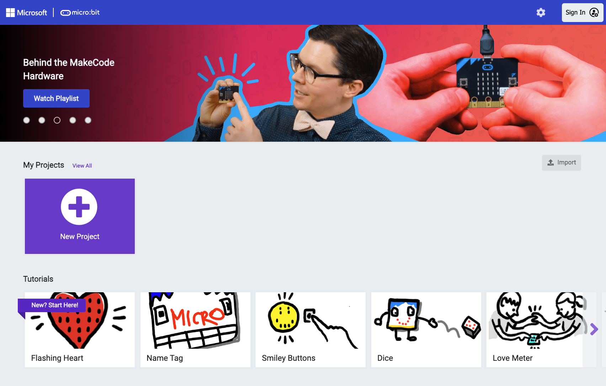
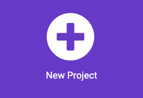
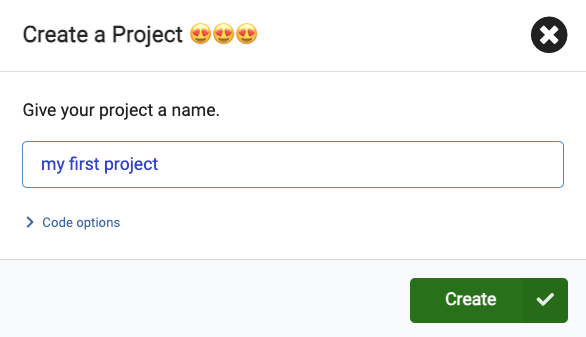
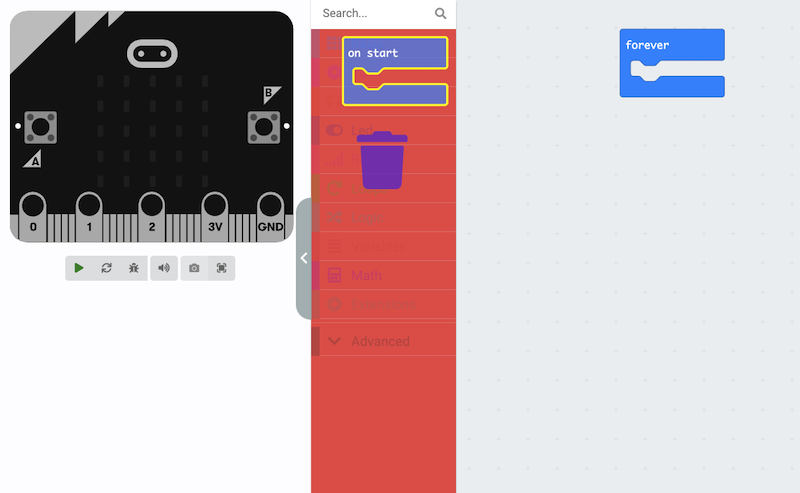
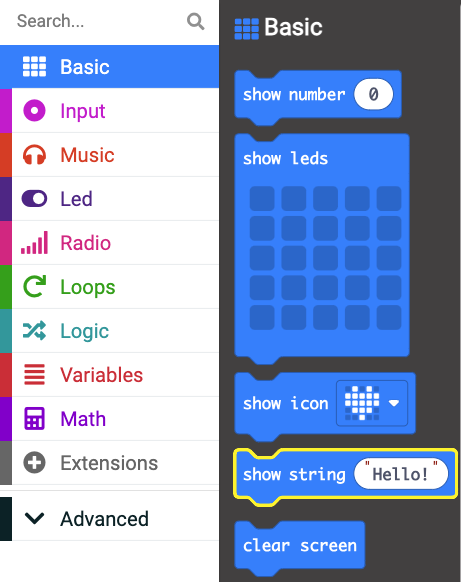
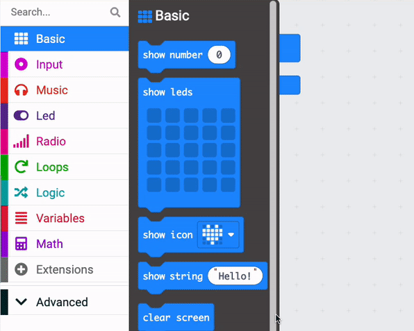
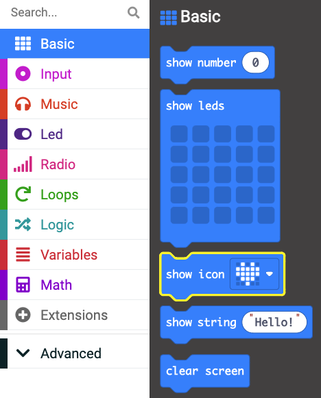
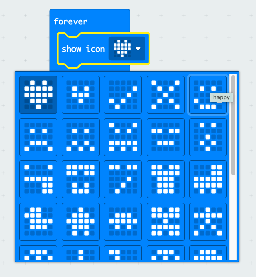

## The MakeCode editor

In this step you will take a tour of the MakeCode editor, and create your first program for the micro:bit. 

### Opening MakeCode

--- task ---

Open the MakeCode editor at [makecode.microbit.org](https://makecode.microbit.org){:target="_blank"}

--- collapse ---

---
title: Offline version of the editor
---

There is also a [downloadable version of the MakeCode editor](https://makecode.microbit.org/offline-app){:target="_blank"}.

--- /collapse ---

--- /task ---

### The MakeCode homepage

The first screen you are presented with is the MakeCode homepage. Here you will find the button to create new projects, and all your existing projects (Once you have made some). 

There are also loads of example projects and tutorials you can jump in to when you are feeling confident using the micro:bit. 

### Start a project

--- task ---

Click on the **New Project** button.

--- /task ---

--- task ---

Give your project a name - we are going with **my first project**.

--- /task ---

--- task ---

Click **Create** to get started with your project

--- /task ---

### The MakeCode editor

Now you are presented with the MakeCode editor, this is the screen you will use to program your micro:bit. 

--- task ---

The very first thing that will happen is you will be offered a tour of the editor. Take the tour to explore the MakeCode interface

--- /task ---

Below is a quick reminder of the different parts of the editor, for you to refer back to later or to help you better understand the interface. 

#### The micro:bit simulator

On the left hand side is a virtual version of the micro:bit - called **the simulator**. This allows you to test your projects while you create them, without having to download them to the physical device. 

#### The Toolbox

The micro:bit can be programmed using blocks, javascript or Python. For your first few projects we recommend you stick with the blocks. 

The toolbox is where you get the blocks that make up your program. It is split into **categories** that are colour coded. You might be used to this sort of thing if you have used Scratch. 

The blocks in each category will do a specific type of task - like playing music or doing maths operations. 

You will be using the Toolbox a lot!

#### The Workspace

This is the biggest section of the editor, and it is where your program goes. 

When you grab blocks from the Toolbox, you will place them in the Workspace. Only things in your Workspace will run. 

### Creating your first program

--- task ---

You only need the <code style="background-color: #1e90ff">forever</code> block for this program. 

Grab the <code style="background-color: #1e90ff">on start</code> and drag it over the Toolbox.

You should see a rubbish bin appear when you do this. Release the block to **delete** it. 

--- /task ---

--- task ---

Open the <code style="background-color: #1e90ff">Basic</code> menu in the Toolbox. 

Grab a <code style="background-color: #1e90ff">show string</code> block. 

--- /task ---

--- task ---

Place the <code style="background-color: #1e90ff">show string</code> block **inside** the <code style="background-color: #1e90ff">forever</code> block in the Workspace. 

The blocks will fit together like puzzle pieces.

--- /task ---

--- task ---

The simulator will immediately run your program, you will see the word `Hello!` scroll across the LEDs. 

Change the text in the <code style="background-color: #1e90ff">show string</code> to your name. 

My name is Mac so I will change it to that. 

<iframe style="position:relative;top:0;left:0;width:100%;height:100%;" src="https://makecode.microbit.org/---codeembed#pub:_T3yfhfdbC9y6" allowfullscreen="allowfullscreen" frameborder="0" sandbox="allow-scripts allow-same-origin"></iframe>

--- /task ---

--- task ---

Again in the <code style="background-color: #1e90ff">Basic</code> menu of the Toolbox, this time grab a <code style="background-color: #1e90ff">show icon</code> block. 

--- /task ---

--- task ---

Drag the <code style="background-color: #1e90ff">show icon</code> block **underneath** the <code style="background-color: #1e90ff">show string</code> block in the Workspace. 

<iframe style="position:relative;top:0;left:0;width:100%;height:100%;" src="https://makecode.microbit.org/---codeembed#pub:_EhKLF2HxhbuL" allowfullscreen="allowfullscreen" frameborder="0" sandbox="allow-scripts allow-same-origin"></iframe>

--- /task ---

The <code style="background-color: #1e90ff">show icon</code> block will display a picture on the LEDs. There are loads for you to choose from. 

--- task ---

Click on the heart icon at the end of the <code style="background-color: #1e90ff">show icon</code> block. 

You will see a drop down, with all the available pre-built icons. 

Pick an icon you like!

--- /task ---

--- task ---

Watch your program in the simulator. 

--- /task ---

In the next step you will learn how to download your program onto your physical micro:bit.