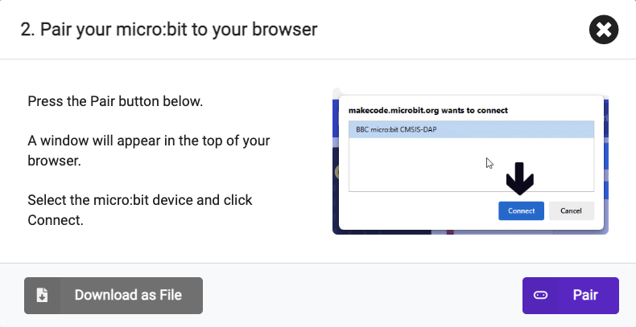
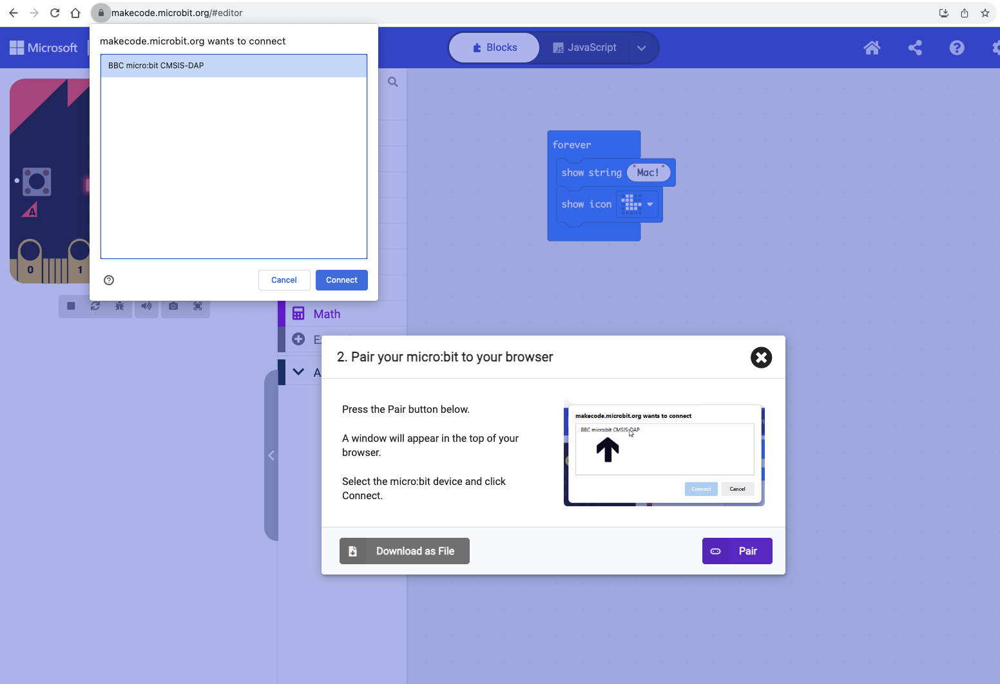
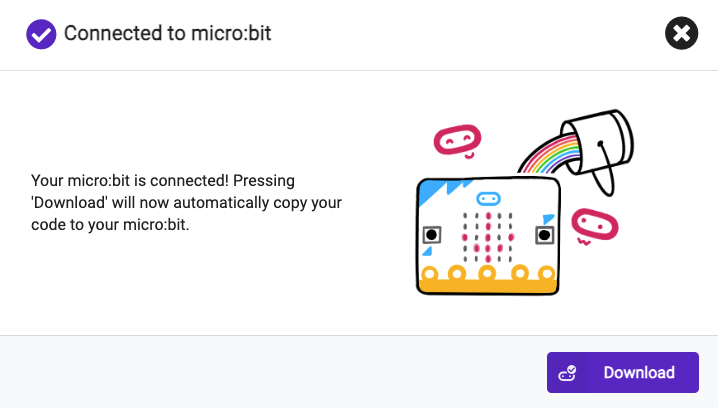

## Connecting the micro:bit

In this step you will connect your physical micro:bit to your computer, pair it with MakeCode and download your first project onto the device. 

### Connecting your micro:bit

--- task ---

Click on the **Download** button below the simulator.

--- /task ---

--- task ---

Now plug the USB cable attached to your micro:bit into your computer. And click **Continue**.

--- /task ---

--- task ---

You will now be given the option to **pair** your micro:bit with MakeCode in your browser. 

Click **Pair**.

--- /task ---

--- task ---

A new window will appear at the top of the browser. 

Select the micro:bit in the list of devices, and click **Connect**. 

--- /task ---

--- task ---

You will see another box telling you the pairing was successful. 

Click **Download** to start the download process.

The yellow light on the back of the micro:it will flash really fast to let you know the program is transferring.

--- /task ---

--- collapse ---

---
title: My microbit won't pair
---

If your micro:bit isn't showing up, try unplugging it and plugging it back in. You can also try a different USB port or USB cable if they are available.

If your micro:bit doesn't pair you can use the **Download** button to download your program as a `.HEX` file. You can then move the program onto your micro:bit using your file system.

**Windows:** Open **File Explorer** and check that you can see `MICROBIT` under `This PC` on the left hand side. If it is there, drag the downloaded `.HEX` file to it, your program will be saved to your micro:bit and you should be able to use it.

**MacOS:** Open **Finder** and check that you can see `MICROBIT` under `Locations` on the left hand side. If it is there, drag the downloaded `.HEX` file to it, your program will be saved to your micro:bit and you should be able to use it.

--- /collapse ---

--- task ---

Watch your program run on your physical micro:bit!

--- /task ---

Well done, you have done your first project on the micro:bit!

The next few steps will show you how to use the features of the micro:bit.