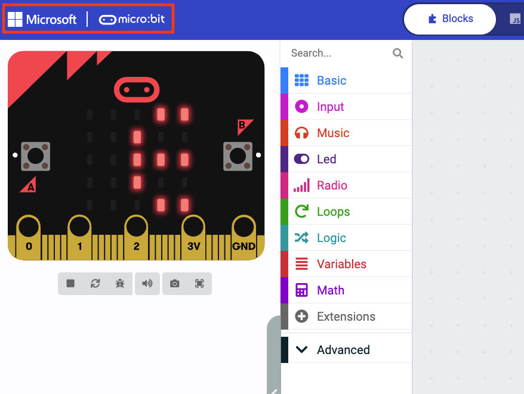
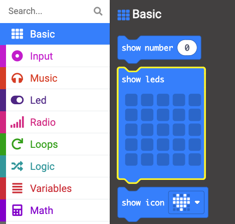
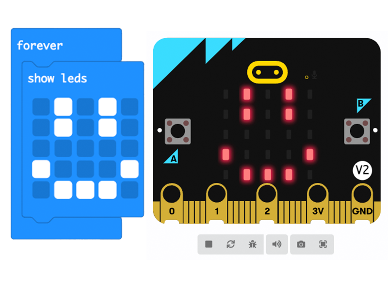

## Using the LEDs

In this step you will learn the ways you can use the LED display on the front of the micro:bit.

### Displaying words

You used this in the last step, you can display words (called a **string** in computing) on the micro:bit's LEDs. 

The words will scroll across from right to left.
   


**Tip:** The words scroll very slowly, so make sure to keep your messages short!

To do this you use the `show string`{:class='microbitbasic'} block from the `Basic`{:class='microbitbasic'} menu in the Toolbox. 

### Pictures (icons)

You can also use the LEDs to display simple pictures and icons. 

In the last step you used the `show icon`{:class='microbitbasic'} block to do this. 

This allows you to choose from pre-programmed icons. 

You can also draw your own! 

--- task ---

Click the MakeCode logo at the top of the editor to go back to the home screen. 



--- /task ---

--- task ---

Click on the **New Project** button.


--- /task ---

--- task ---

Name your project `drawing icons` and click **Create**

--- /task ---

--- task ---

Open the `Basic`{:class='microbitbasic'} menu in the Toolbox and find the `show leds`{:class='microbitbasic'} block. 



--- /task ---

--- task ---

Drag this into the Workspace and place it inside the `forever`{:class='microbitbasic'} block. 

```microbit
basic.forever(function () {
    basic.showLeds(`
        . . . . .
        . . . . .
        . . . . .
        . . . . .
        . . . . .
        `)
})
```

--- /task ---

--- task ---

You can draw your icons by click on the squares, a white filled in square will mean the LED lights up. 

Draw yourself an icon and test it out in the simulator.



--- /task ---

### Showing numbers

You can also use the `show number`{:class='microbitbasic'} block to display numbers. 

If it is a single digit numer (0-9) it will take the whole screen. Any more than that the number will scroll like the words. 

You will use this block in the next step to test the sensors! 