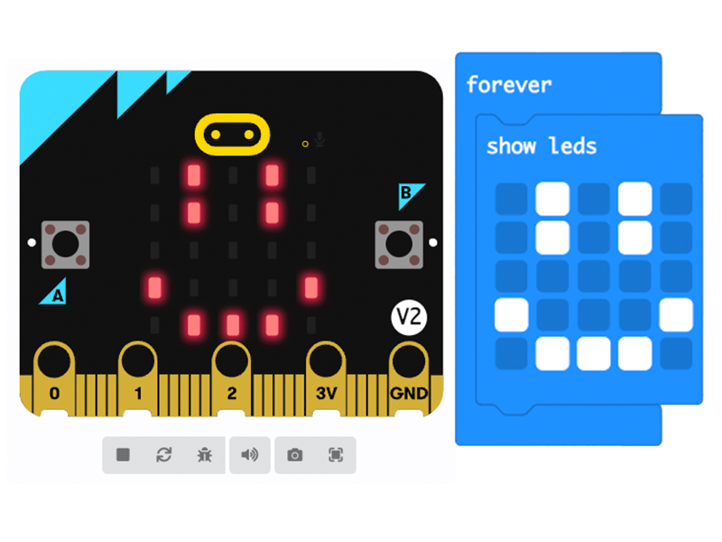

## Using the LEDs

In this step you will learn the ways you can use the LED display on the front of the micro:bit.

### Displaying words

You used this in the last step, you can display words (called a **string** in computing) on the micro:bit's LEDs. 

The words will scroll across from right to left.
   

**Tip:** The words scroll very slowly, so make sure to keep your messages short!

To do this you use the <code style="background-color: #1e90ff">show string</code> block from the <code style="background-color: #1e90ff">Basic</code> menu in the Toolbox. 

### Pictures (icons)

You can also use the LEDs to display simple pictures and icons. 

In the last step you used the <code style="background-color: #1e90ff">show icon</code> block to do this. 

This allows you to choose from pre-programmed icons. 

You can also draw your own! 

--- task ---

Click the MakeCode logo at the top of the editor to go back to the home screen. 

--- /task ---

--- task ---

Click on the **New Project** button.

--- /task ---

--- task ---

Name your project `drawing icons` and click **Create**

--- /task ---

--- task ---

Open the <code style="background-color: #1e90ff">Basic</code> menu in the tool box and find the <code style="background-color: #1e90ff">show leds</code> block. 

--- /task ---

--- task ---

Drag this into the Workspace and place it inside the <code style="background-color: #1e90ff">forever</code> block. 

<iframe style="position:relative;top:0;left:0;width:100%;height:100%;" src="https://makecode.microbit.org/---codeembed#pub:S60649-84652-14785-29638" allowfullscreen="allowfullscreen" frameborder="0" sandbox="allow-scripts allow-same-origin"></iframe>

--- /task ---

--- task ---

You can draw your icons by click on the squares, a white filled in square will mean the LED lights up. 

Draw yourself an icon and test it out in the simulator.

--- /task ---

### Showing numbers

You can also use the <code style="background-color: #1e90ff">show number</code> block to display numbers. 

If it is a single digit numer (0-9) it will take the whole screen. Any more than that the number qill scroll like the words. 

You will use this block in the next step to test the sensors! 