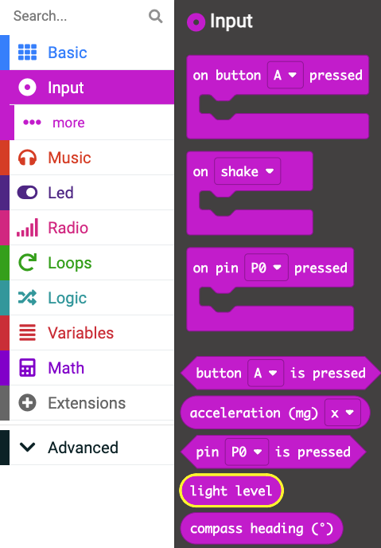

## Using the sensors

In this step you will use the sensors on the micro:bit to record the world around you. 

### Light sensor

The micro:bit has an on board sensor that can read the light levels in the environment. 

The sensor returns a numbers between 0 and 255 - 255 being the mos tlight the sensor can detect. 

--- task ---

Choose: Delete any code inside your <code style="background-color: #1e90ff">forever</code> block

**or** 

go back to the home screen and create a new project called `sensor test`.

--- /task ---

--- task ---

Open the <code style="background-color: #1e90ff">Basic</code> menu in the Toolbox. Find the <code style="background-color: #1e90ff">show number</code> block. 

--- /task ---

--- task ---

Drag it into the <code style="background-color: #1e90ff">forever</code> block. 

<iframe style="position:relative;top:0;left:0;width:100%;height:100%;" src="https://makecode.microbit.org/---codeembed#pub:_5FWTok5cqAkM" allowfullscreen="allowfullscreen" frameborder="0" sandbox="allow-scripts allow-same-origin"></iframe>

--- /task ---

--- task ---

Now open the <code style="background-color: #d400d4">Input</code> menu. 

Find the <code style="background-color: #d400d4">light level</code> block.

--- /task ---

--- task ---

Drag the block over the top of the `0` in the <code style="background-color: #1e90ff">show number</code> block.

<iframe style="position:relative;top:0;left:0;width:100%;height:100%;" src="https://makecode.microbit.org/---codeembed#pub:_1qPWK1W2iDkt" allowfullscreen="allowfullscreen" frameborder="0" sandbox="allow-scripts allow-same-origin"></iframe>

--- /task ---

--- task ---

Click the **Download** button to save your program to your micro:bit. 

--- /task ---

--- task ---

Test your program to see the number change as you put it in shade and under lights.

--- /task ---

### Other sensors

You can read other sensors on the micro:bit as well, using the same code as above. 

#### Temperature

Inside the <code style="background-color: #d400d4">Input</code> menu there is also a block for <code style="background-color: #d400d4">temperature</code> - which is a reading from the onboard thermometer. 

--- task ---

Delete the <code style="background-color: #d400d4">light level</code> block by dragging it over the Toolbox

--- /task ---

--- task ---

Open the <code style="background-color: #d400d4">Input</code> menu and find the <code style="background-color: #d400d4">temperature</code> block. 

--- /task ---

--- task ---

Place this block into the `0` of the <code style="background-color: #1e90ff">show number</code> block.

<iframe style="position:relative;top:0;left:0;width:100%;height:100%;" src="https://makecode.microbit.org/---codeembed#pub:_Ya7UEa1kTbir" allowfullscreen="allowfullscreen" frameborder="0" sandbox="allow-scripts allow-same-origin"></iframe>

--- /task ---

--- task ---

Download this program onto your micro:bit by clicking the **Download** button.

--- /task ---

--- task ---

Test out the program to see the temperature in the room you are coding in!

--- /task ---

#### Sound sensor (V2 only)

On the micro:bit V2, there is a brand new sound sensor! You can use this to react to the sound level in the room. 

The sound level will be read as a number between `0` (no sound at all) and `255` (very loud sound). 

--- task ---

Delete the <code style="background-color: #d400d4">temperature</code> block.

--- /task ---

--- task ---

Open the <code style="background-color: #d400d4">Input</code> menu and look in the **micro:bit v2** section to find the <code style="background-color: #d400d4">sound level</code> block. 

--- /task ---

--- task ---

Place the <code style="background-color: #d400d4">sound level</code> block over the top of the `0` in the <code style="background-color: #1e90ff">show number</code> block. 

--- /task ---

--- task ---

Download the program to your physical micro:bit and test it out by making loud and quiet noises! Watch the number change.

--- /task ---