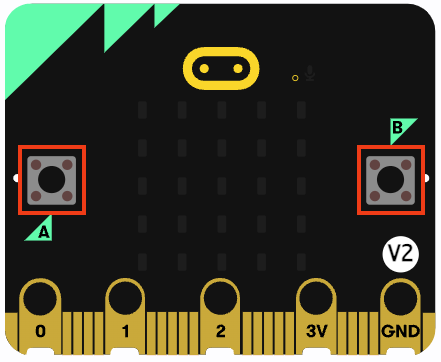
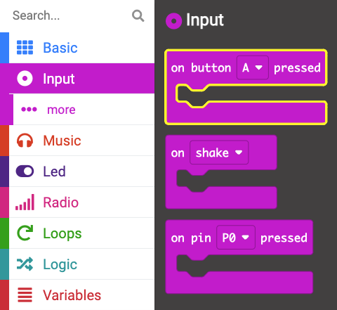
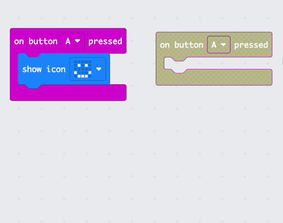
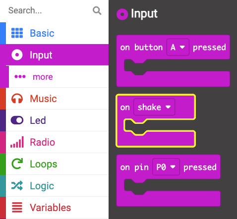
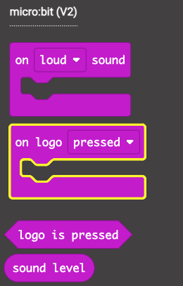
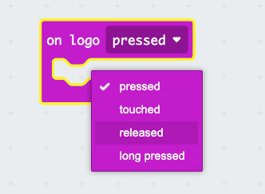

## Inputs

In this step you will use the buttons and some gestures to trigger **events** on your micro:bit. 

### Set up your workspace

--- task ---

**Choose:** Delete your previous code by dragging it over the Toolbox

**or**

Go back to the home screen and make a new project

--- /task ---

### Using the buttons

All micro:bits have **two** buttons you can use to trigger pieces of code in your programs. 

You can find the blocks to use the buttons in the <code style="background-color: #d400d4">Input</code> menu. 

--- task ---

Open the <code style="background-color: #d400d4">Input</code> menu and find the <code style="background-color: #d400d4">on button pressed</code> block.

--- /task ---

--- task ---

Drag the block into the workspace. 

--- /task ---

This is an **event** block, you can put other blocks inside of it and they will all run when the event happens. In this case the event is **button A being pressed**.

--- task ---

Drag a <code style="background-color: #1e90ff">show icon</code> block into the <code style="background-color: #d400d4">on button pressed</code>

--- /task ---

--- task ---

Choose an icon to show when the A button is pressed.

--- /task ---

--- task ---

Test your program on the simulator, press the A button to see your icon.

--- /task ---

### Adding the other button

You can have many events in a single program! 

--- task ---

Open the <code style="background-color: #d400d4">Input</code> menu and drag another <code style="background-color: #d400d4">on button pressed</code> block into the Workspace.

--- /task ---

At first the block will be faded out, because you can only have one reaction for each event. 

--- task ---

Use the dropdown to change the button for the event to `B` instead. 

--- /task ---

--- task ---

Add a block to run when you press B. 

You can use <code style="background-color: #1e90ff">show string</code>, <code style="background-color: #1e90ff">show leds</code> to draw your own icon or <code style="background-color: #1e90ff">show icon</code> to pick another pre-made icon.

--- /task ---

### Gestures

You can also use **gestures** as events in your programs as well. 

Gestures are movements with the micro:bit that you can react to, like **shake**, **tilting left or right** or **dropping** the micro:bit. 

--- task ---

In the <code style="background-color: #d400d4">Input</code> menu find the <code style="background-color: #d400d4">on shake</code> block.

Drag it into your Workspace.

--- /task ---

This block will trigger whenever the micro:bit is shaken! 

--- task ---

Add some code to show something on the LEDs when you shake the micro:bit. either an icon, some words or a number!

--- /task ---

Your finalised code should look something like this...

<iframe style="position:relative;top:0;left:0;width:100%;height:100%;" src="https://makecode.microbit.org/---codeembed#pub:S04707-54406-72922-48640" allowfullscreen="allowfullscreen" frameborder="0" sandbox="allow-scripts allow-same-origin"></iframe>

### Touch logo (V2 only)

The newer version of the micro:bit has some extra events that use the new **touch sensitive** logo. 

You can trigger code when:

+ The logo is pressed 
+ The logo is held for a long time
+ The logo is released. 

--- task ---

If you are using a micro:bit V2, open the <code style="background-color: #d400d4">Input</code> menu and scroll to the micro:bit V2 section. 

Drag the <code style="background-color: #d400d4">on logo</code> block into your Workspace. 

--- /task ---

--- task ---

Use the dropdown to change the event the <code style="background-color: #d400d4">on logo</code> block uses.

--- /task ---

--- task ---

This is another event, so you can add some code inside the <code style="background-color: #d400d4">on logo</code> block.

This code will run when the event you have selected happens. 

In this example we have chosen to show some text when the logo is touched.

<iframe style="position:relative;top:0;left:0;width:100%;height:100%;" src="https://makecode.microbit.org/---codeembed#pub:_V9hYXX59Mf9h" allowfullscreen="allowfullscreen" frameborder="0" sandbox="allow-scripts allow-same-origin"></iframe>

--- /task ---