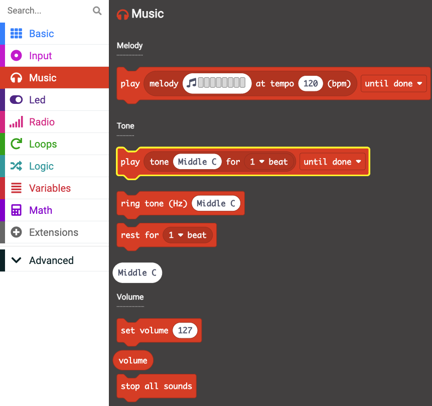
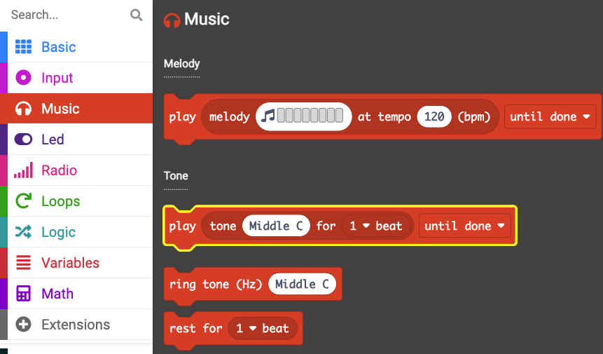
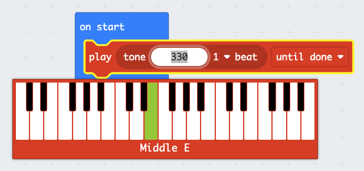
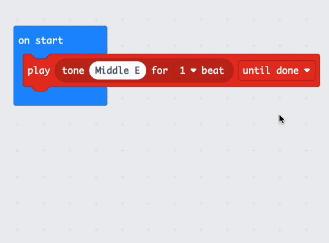
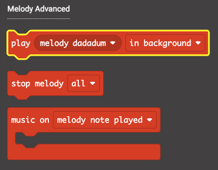
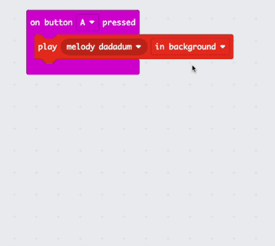
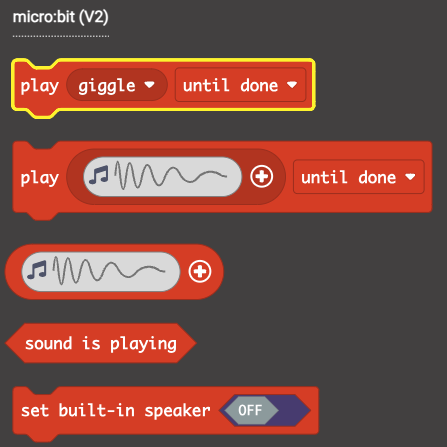
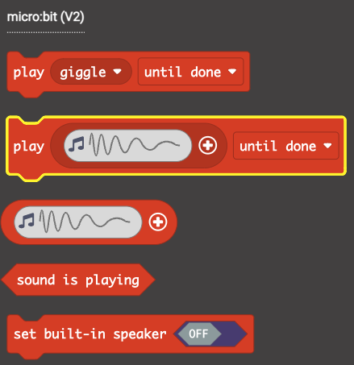
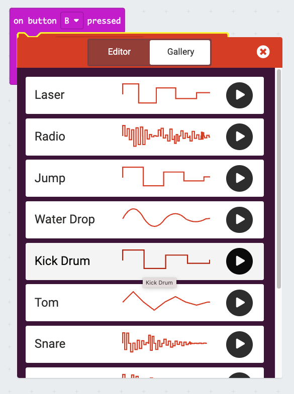

## Sounds

In this step you will see how the micro:bit can play sounds including notes, melodies and short audio clips (V2 only). 

The blocks in this step will all come from the `Music`{:class='microbitmusic'} menu in the Toolbox.

If you are using a V1 micro:bit, you will need **wired** headphones and two **crocodile clip** cables for this step.

### Set up your workspace

--- task ---

**Choose:** Delete your previous code by dragging it over the Toolbox

**or**

Go back to the home screen and make a new project

--- /task ---

--- collapse ---

---
title: Playing sound on the V1 micro:bit
---

If you are using a micro:bit V1, there is no speaker to play the sounds, instead you have to attach headphones to the GPIO pins. 

Take a look at the [guide from micro:bit to help you attach your headphones](https://makecode.microbit.org/projects/hack-your-headphones/make){:target="_blank"}. 

You will want to set the volume of the sound to around `60` before testing, as it is very **loud** by default.

You can test whether they are working with the following code: 

```microbit
music.setVolume(60)
music.play(music.tonePlayable(262, music.beat(BeatFraction.Double)), music.PlaybackMode.UntilDone)
```

You can find the `play tone`{:class='microbitmusic'} and `set volume`{:class='microbitmusic'} blocks in the `Music`{:class='microbitmusic'} menu of your Toolbox. 



You will have to download the program onto your micro:bit for this test. 

**Once you are sure it is working, make sure to delete the `play tone`{:class='microbitmusic'} block**

--- /collapse ---

### Playing notes

The micro:bit can play individual notes or **tones**. 

--- task ---

Open the <code style="background-color: #e63022">Music</code> menu in the Toolbox. 

Find the <code style="background-color: #e63022">play tone</code> block. 



--- /task ---

--- task ---

Drag the <code style="background-color: #e63022">play tone</code> into the <code style="background-color: #1e90ff">on start</code> block. 

--- /task ---

--- task ---

Click on the `Middle C` part of the <code style="background-color: #e63022">play tone</code> block, to change the note. 

Select `Middle E`. 



--- /task ---

--- task ---

Right click on the <code style="background-color: #e63022">play tone</code> block, and select **Duplicate**.



Place the new block underneath the original inside the <code style="background-color: #1e90ff">on start</code> block.

--- /task ---

--- task ---

Duplicate the block **five** more times. 

You should have **seven** <code style="background-color: #e63022">play tone</code> blocks in total.

--- /task ---

--- task ---

Change the notes in the <code style="background-color: #e63022">play tone</code> blocks so they match the code below. 

<div style="position:relative;height:calc(350px + 5em);width:100%;overflow:hidden;"><iframe style="position:relative;top:0;left:0;width:100%;height:100%;" src="https://makecode.microbit.org/---codeembed#pub:_02L8caPEoP5a" allowfullscreen="allowfullscreen" frameborder="0" sandbox="allow-scripts allow-same-origin"></iframe></div>

The notes are:
1. Middle E
2. Middle D
3. Middle C
4. Middle D
5. Middle E
6. Middle E
7. Middle E

--- /task ---

--- task ---

Listen to the tones when you are done, can you guess which song is playing?

--- /task ---

--- task ---

**Optional:** Use the internet to find the starting notes of a song you love, see if you can change the tones in your <code style="background-color: #1e90ff">on start</code> block to match them. 

--- /task ---

### Playing melodies

You can also play some pre-programmed melodies from your micro:bit. 

You are going to use the <code style="background-color: #d400d4">Input</code> events you learned about in the last step to do this. 

--- task ---

Open the <code style="background-color: #d400d4">Input</code> menu of your tool box and drag an <code style="background-color: #d400d4">on button</code> block into your workspace.

--- /task ---

--- task ---

In the <code style="background-color: #e63022">Music</code> menu of the Toolbox find the <code style="background-color: #e63022">play melody</code> block in the **Melody Advanced** section.



--- /task ---

--- task ---

Drag the <code style="background-color: #e63022">play melody</code> block inside the <code style="background-color: #d400d4">on button</code> block. 

<div style="position:relative;height:calc(150px + 5em);width:100%;overflow:hidden;"><iframe style="position:relative;top:0;left:0;width:100%;height:100%;" src="https://makecode.microbit.org/---codeembed#pub:_Uo0PamXrtUP2" allowfullscreen="allowfullscreen" frameborder="0" sandbox="allow-scripts allow-same-origin"></iframe></div>

--- /task ---

--- task ---

Use the dropdown to select a different melody. 



--- /task ---

--- task ---

Test your program using both the simulator and your physical micro:bit.

--- /task ---

--- task ---

If you are using a micro:bit V1, create another <code style="background-color: #d400d4">on button block</code> to play a second melody when **Button B** is pressed.

--- /task ---

### Playing short audio clips (micro:bit V2 only)

On the newer micro:bit - alongside the microphone you have the ability to play short audio clips. 

--- task ---

From the <code style="background-color: #d400d4">Input</code> menu drag another <code style="background-color: #d400d4">on button</code> block to your workspace. 

Change the button from `A` to `B`.

--- /task ---

--- task ---

Open the <code style="background-color: #e63022">Music</code> menu and find the <code style="background-color: #e63022">play</code> block from the micro:bit V2 section. 



--- /task ---

--- task ---

Drag the <code style="background-color: #e63022">play</code> block inside the <code style="background-color: #d400d4">on button B</code> block.

<div style="position:relative;height:calc(150px + 5em);width:100%;overflow:hidden;"><iframe style="position:relative;top:0;left:0;width:100%;height:100%;" src="https://makecode.microbit.org/---codeembed#pub:_WTXie8hz4KoF" allowfullscreen="allowfullscreen" frameborder="0" sandbox="allow-scripts allow-same-origin"></iframe></div>

--- /task ---

--- task ---

Click on the `giggle` part and select another clip. 

<div style="position:relative;height:calc(150px + 5em);width:100%;overflow:hidden;"><iframe style="position:relative;top:0;left:0;width:100%;height:100%;" src="https://makecode.microbit.org/---codeembed#pub:_9vuL8kM9f7mR" allowfullscreen="allowfullscreen" frameborder="0" sandbox="allow-scripts allow-same-origin"></iframe></div>

We have chosen `mysterious`!

--- /task ---

--- task ---

Download the program onto your physical micro:bit. 

Test the program out, listen to the initial song and then press both the buttons to hear the melody and audio clip. 

--- /task ---

### Challenge (Optional)

Make a new program and use what you have learned about events to create a piano (V1) or drum kit (V2).

--- collapse ---

---
title: Drum noises for V2 micro:bit
---

You can get specific drum noises in the micro:bit v2 section of the <code style="background-color: #e63022">Music</code> menu. 



If you use the dropdown on the block above, and open the **Gallery** tab to select one of the drum noises. 



--- /collapse ---

Use the button events and add some sounds, so when you press each of the buttons the notes or drum noises play.