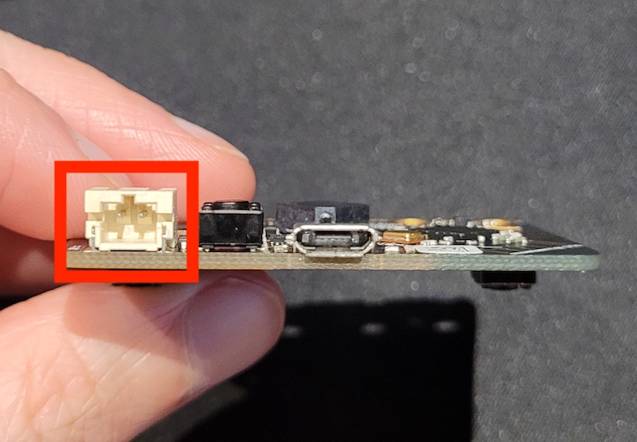

## Powering the micro:bit

In this step you will learn how to run your micro:bit when it is not connected to the computer. 

For this step you will need the **battery pack** and **batteries** that came with your micro:bit. 

--- collapse ---

---
title: You have no batteries or battery pack
---

If you didn't get any batteries or a battery pack, then you can still make all the amazing projects with the micro:bit that both we at the Raspberry Pi Foundation and the micro:bit Foundation have. 

The connector used for the battery pack is quite common **2 pin** connector. So another battery pack you have (as long as it only takes two batteries) should work too.

--- /collapse ---

### Connect the batteries

--- task ---

Make sure the program you want to run is on the micro:bit.

--- /task ---

--- task ---

Disconnect the micro USB cable from the micro:bit.

--- /task ---

--- task ---

Put the batteries in the battery pack, make sure to line up the `-` and `+` sides of the batteries with the slots.

--- /task ---

--- task ---

Connect the battery pack to the white connector in the top left corner of the micro:bit. 

There is a line on one side of the battery pack, this will slot into the line on the battery pack connector. 

--- /task ---

The micro:bit should power up, running the program you downloaded onto it.

--- task ---

You can reset the micro:bit by clicking the button next to the battery pack connector on the back on the micro:bit. 

--- /task ---

### Try out your programs!

--- task ---

Make sure to disconnect the battery pack before you plug your micro:bit back in to your computer.

--- /task ---

Take a few of the programs you have made during this project, download the programs onto your micro:bit.

Test them out with the battery pack, take it to show your friends or family what you have made! 

Well done, you now have loads of experience with the micro:bit!