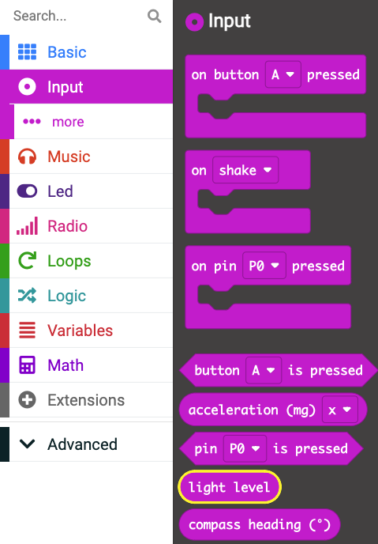
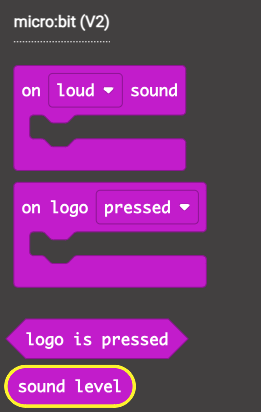

## Using the sensors

In this step you will use the sensors on the micro:bit to record the world around you.

### Light sensor

The micro:bit has an on board sensor that can read the light levels in the environment.

The sensor returns a numbers between 0 and 255 - 255 being the most light the sensor can detect.

\--- task ---

**Choose:**

Delete any code inside your `forever`{:class='microbitbasic'} block.

**or**

Go back to the home screen and create a new project called `sensor test`.

\--- /task ---

\--- task ---

Open the `Basic`{:class='microbitbasic'} menu in the Toolbox. Find the `show number`{:class='microbitbasic'} block.


\--- /task ---

\--- task ---

Drag it into the `forever`{:class='microbitbasic'} block.

```microbit
basic.forever(function () {
    basic.showNumber(0)
})
```

\--- /task ---

\--- task ---

Now open the `Input`{:class='microbitinput'} menu.

Find the `light level`{:class='microbitinput'} block.



\--- /task ---

\--- task ---

Drag the block over the top of the `0` in the `show number`{:class='microbitbasic'} block.

```microbit
basic.forever(function () {
    basic.showNumber(input.lightLevel())
})
```

\--- /task ---

\--- task ---

Click the **Download** button to save your program to your micro:bit.

\--- /task ---

\--- task ---

Test your program to see the number change as you put it in shade and under lights.

\--- /task ---

### Other sensors

You can read other sensors on the micro:bit as well, using the same code as above.

#### Temperature

Inside the `Input`{:class='microbitinput'} menu there is also a block for `temperature`{:class='microbitinput'} - which is a reading from the onboard thermometer.

\--- task ---

Delete the `light level`{:class='microbitinput'} block by dragging it over the Toolbox

\--- /task ---

\--- task ---

Open the `Input`{:class='microbitinput'} menu and find the `temperature`{:class='microbitinput'} block.


\--- /task ---

\--- task ---

Place this block into the `0` of the `show number`{:class='microbitbasic'} block.

```microbit
basic.forever(function () {
    basic.showNumber(input.temperature())
})
```

\--- /task ---

\--- task ---

Download this program onto your micro:bit by clicking the **Download** button.

\--- /task ---

\--- task ---

Test out the program to see the temperature in the room you are coding in!

\--- /task ---

#### Sound sensor (V2 only)

On the micro:bit V2, there is a brand new sound sensor! You can use this to react to the sound level in the room.

The sound level will be read as a number between `0` (no sound at all) and `255` (very loud sound).

\--- task ---

Delete the `temperature`{:class='microbitinput'} block.

\--- /task ---

\--- task ---

Open the `Input`{:class='microbitinput'} menu and look in the **micro:bit v2** section to find the `sound level`{:class='microbitinput'} block.



\--- /task ---

\--- task ---

Place the `sound level`{:class='microbitinput'} block over the top of the `0` in the `show number`{:class='microbitbasic'} block.

```microbit
basic.forever(function () {
    basic.showNumber(input.soundLevel())
})
```

\--- /task ---

\--- task ---

Download the program to your physical micro:bit and test it out by making loud and quiet noises! Watch the number change.

[[[download-to-microbit]]]

\--- /task ---
